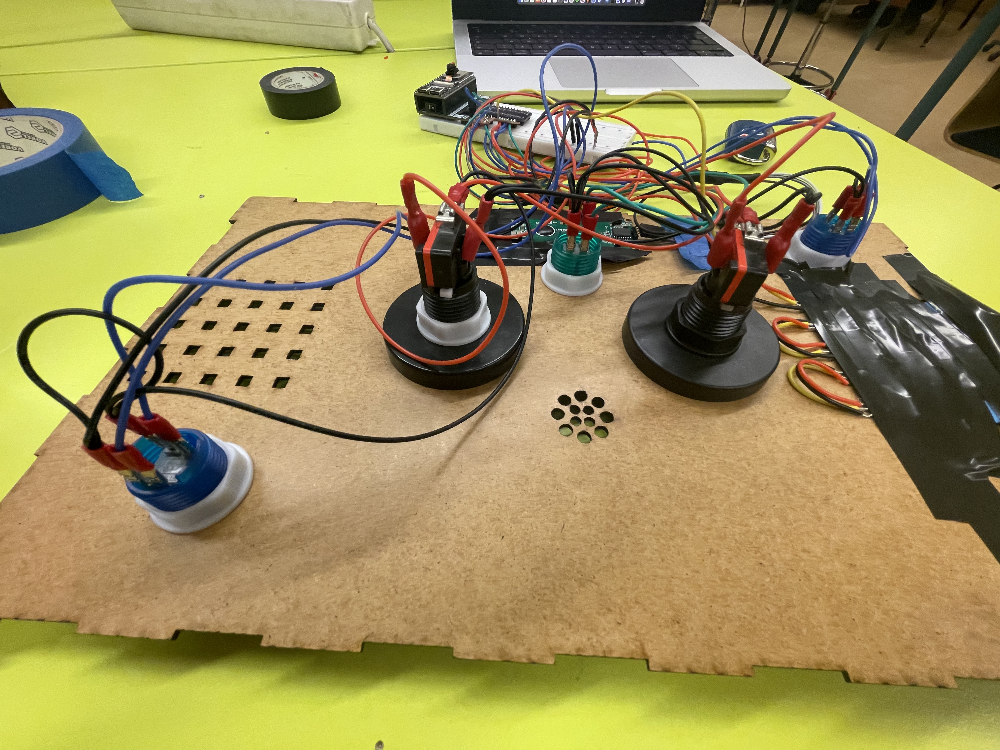
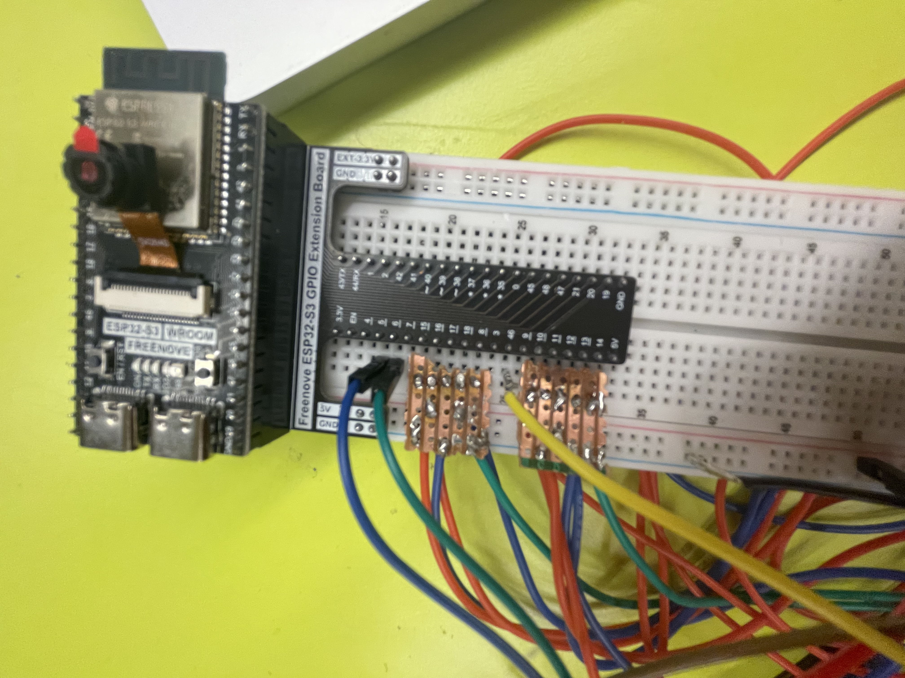
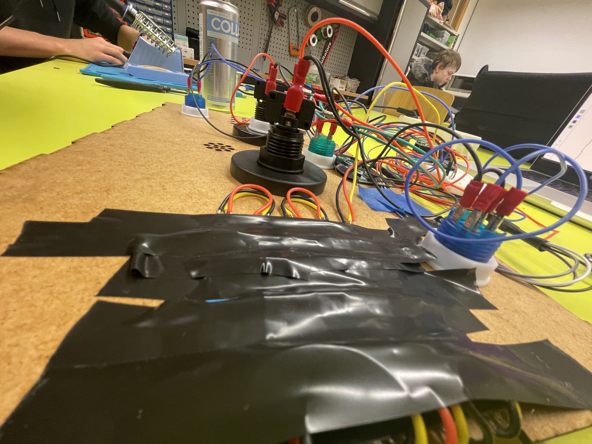
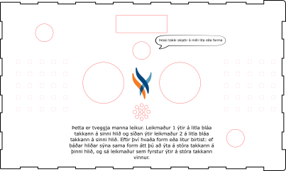

# Lokaverkefni Verksmiðu 1

### Lýsing & Myndband

## lýsing
Þetta er tveggja manna leikur. Leikmaður 1 ýtir á litla bláa takkann á sinni hlið og síðan ýtir leikmaður 2 á litla bláa takkann á sinni hlið. Eftir því hvaða form eða litur birtist. Ef báðar hliðar sýna sama form átt þú að ýta á stóra takkann á þinni hlið, og sá leikmaður sem ýtir fyrstur á stóra takkann vinnur

## Myndir

### Ljósmyndir af borðspili & lóðun

### Hönnunarteikning & kóðaskrá

<!-- hafa þessu neðst-->
### Höfundar
  - Marjón Neils Rizon Germino: [howka](https://github.com/howka)
  - Júlíus Kristjánsson: [Plansat](https://github.com/Plansat)

